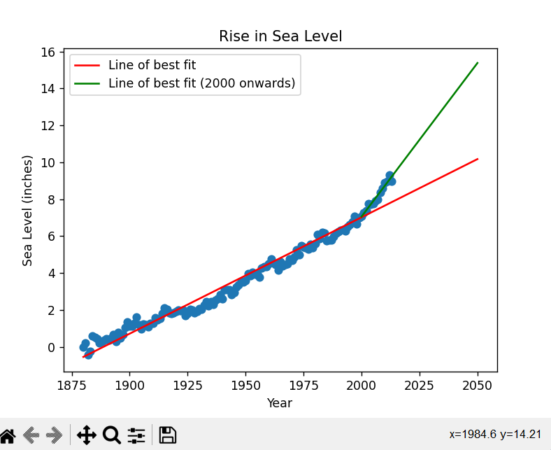

# Project: Rise in Sea Level

This project analyzes the rise in sea level over time using data provided by the Environmental Protection Agency (EPA). The data contains the yearly average sea level change from 1880 to 2014.

## Requirements

- pandas
- matplotlib
- scipy

## Results

The scatter plot shows a clear upward trend in sea level over time. The line of best fit for the entire dataset has a positive slope of 0.063 ± 0.006 inches per year, indicating a steady rise in sea level over the past century. The line of best fit for data from 2000 onwards has a steeper positive slope of 0.166 ± 0.026 inches per year, suggesting that the rate of sea level rise may be accelerating.

## Credits

- Data source: [EPA](https://www.epa.gov/climate-indicators/climate-change-indicators-sea-level)
- Project idea and starter code: [freeCodeCamp](https://www.freecodecamp.org/learn/data-analysis-with-python/data-analysis-with-python-projects/sea-level-predictor)
